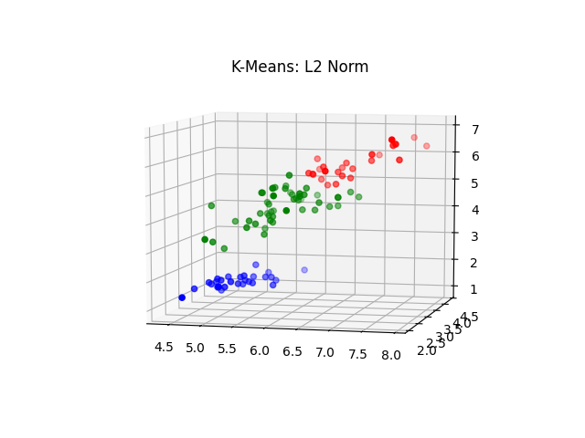
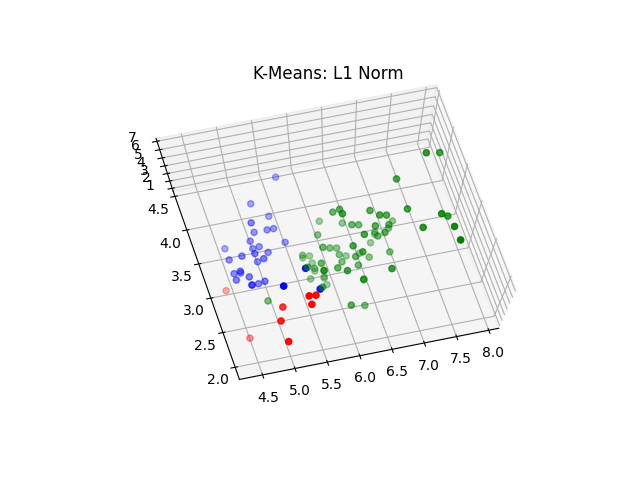
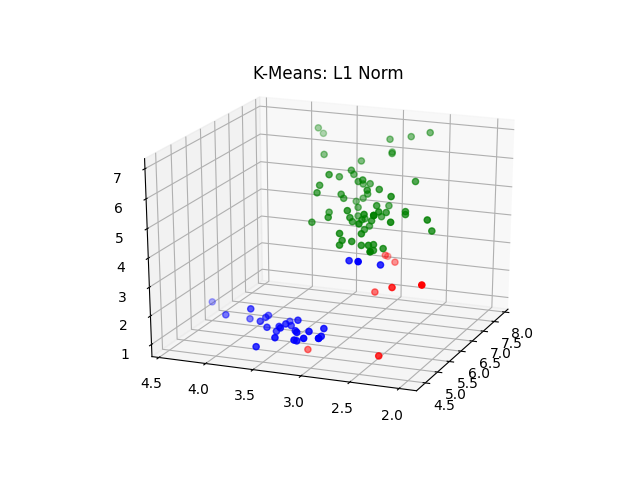
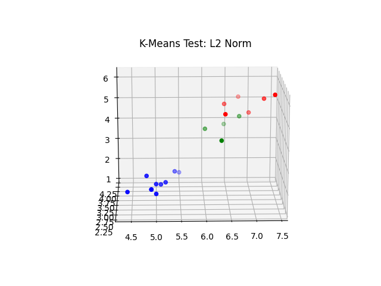

# Lloyd's algorithm for K-means clustering. 

The repo contain Lloyd's algorithm for K-Means clustering, which consists of two steps:

* Assignment step: Each observation in the data is assigned to the nearest cluster by use of the Euclidean distance from the point in the data to the cluster centroid.
* Update step: The mean of each cluster is calculated and assigned as the new centroid.


### Tasks

1) Run implementation of K-means on iris_train.csv dataset for both L2 and L1 norm.

2) Submit a csv file that is the source dataset with an appended column of
classification.

3) Submit images of the points plotted in multivariate space and color coded based
on classification (for both norms).

4) Now import both ​ iris_train.csv and iris_test.csv ​ , and produce a model on the train
dataset for each norm above. Finally give metrics of prediction accuracy on the
test data for each norm.

#### Run implementation

A sript that generates the files listed above is provided. Run 

```python
python train_iris.py
```

An 80/20 split is used for training and testing.

Implementation of K-Means can be found inside `cluster/Kmeans.py`, while L1 and L2 norms can be found in
`clustering/util/distance.py`.

#### Resulting files

The following files were generated on a previous run:

- `data/results/train_results_l2.csv`: Results for training using L2-Norm
- `data/results/train_results_l1.csv`: Results for training using L1-Norm
- `data/results/test_results_l2.csv`: Test results using L2-Norm.
- `data/results/test_results_l1.csv`: Test results using L1-Norm.

#### (Sample) Test results using L2-Norm

The below table is a sample of the file `data/results/train_results_l2.csv`, where the column name
`ground` is the ground truth and `predicted` is a converted version of the predicted results from K-Means. The K-means
algorithm provided returns the predictions as one hot labels (in string format, can be converted back by `int(label)`). The
labels are then matched to the labels corresponding to the ground truth. 


|one|two|three|four|ground         |predicted      |
|---|---|-----|----|---------------|---------------|
|4.8|3.4|1.9  |0.2 |Iris-setosa    |Iris-setosa    |
|6.4|3.1|5.5  |1.8 |Iris-virginica |Iris-virginica |
|5.4|3.9|1.7  |0.4 |Iris-setosa    |Iris-setosa    |
|6.4|2.7|5.3  |1.9 |Iris-virginica |Iris-virginica |
|7.4|2.8|6.1  |1.9 |Iris-virginica |Iris-virginica |
|4.9|3.1|1.5  |0.1 |Iris-setosa    |Iris-setosa    |
|5.1|3.5|1.4  |0.3 |Iris-setosa    |Iris-setosa    |
|4.9|3.1|1.5  |0.1 |Iris-setosa    |Iris-setosa    |
|6.3|2.3|4.4  |1.3 |Iris-versicolor|Iris-versicolor|
|5.0|3.4|1.5  |0.2 |Iris-setosa    |Iris-setosa    |
|5.5|4.2|1.4  |0.2 |Iris-setosa    |Iris-setosa    |
|6.4|3.2|4.5  |1.5 |Iris-versicolor|Iris-versicolor|
|6.7|3.0|5.0  |1.7 |Iris-versicolor|Iris-virginica |
|6.7|3.3|5.7  |2.5 |Iris-virginica |Iris-virginica |
|6.0|2.9|4.5  |1.5 |Iris-versicolor|Iris-versicolor|
|5.2|3.5|1.5  |0.2 |Iris-setosa    |Iris-setosa    |
|4.4|3.2|1.3  |0.2 |Iris-setosa    |Iris-setosa    |
|7.2|3.0|5.8  |1.6 |Iris-virginica |Iris-virginica |
|6.9|3.1|5.1  |2.3 |Iris-virginica |Iris-virginica |
|5.0|3.2|1.2  |0.2 |Iris-setosa    |Iris-setosa    |


#### Visualization of results

Graph using L2-Norm (Training)




Two views of L1-Norm (Training)





Test visualization using L2-Norm




#### Evaluation

Unfortunately I ran out of time. I apologize in advance. I realized at the end that I should have included an evaluation metric
from ghe beginning, such as Recall, Precession, F-Score, and/or Percentage of Variance Explained (PVE). 